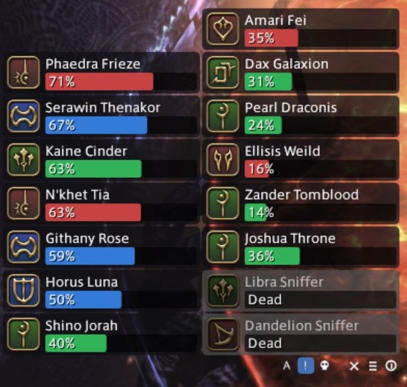

# Nearby Player List

A Dalamud plugin for FINAL FANTASY XIV. It shows a compact, clickable list of the
player characters you can actually target, so you can heal or raise someone without
hunting for them with the mouse.

It is built for content where a crowd works toward the same goal without being in your
party: The Hunt, the Diadem, Eureka, Bozja and the Occult Crescent. Bodies stack on top
of each other in those places and clicking the right one is miserable.

This is not a list of everyone in the zone. It only lists players you can select and
interact with. For a full zone roster, use Wholist.



## Features

- A borderless, transparent, auto-sizing window. Only the player boxes take clicks, so
  the list never eats a click meant for the game. Hold **Shift** and drag from anywhere to
  move it.
- One box per player with the job icon, the name, and an HP bar colored by role: blue
  tank, green healer, red dps.
- Dead players are grayed out. The HP bar reads "Raised" when a raise is pending, and
  "Being raised by <name>" while someone is casting one.
- Your target, soft target, focus target and party members each get their own
  highlight color.
- Clicking a box selects that player.
- A small button strip pinned to the same corner the list grows away from: hide the
  list, open settings, and a help icon that reminds you Shift moves the window.
- Filter mode buttons in that same strip, for switching between show all, show the
  hurt, and show only the dead without opening settings.

## Installing

The plugin is distributed through my custom Dalamud repository.

1. Type `/xlsettings` in game.
2. Open the **Experimental** tab.
3. Paste this into the empty box under **Custom Plugin Repositories**:

   ```
   https://raw.githubusercontent.com/joshua88wa/FFXIV/main/Dalamud/repo.json
   ```

4. Press **+**, make sure the checkbox next to it is on, then press **Save and Close**.
5. Open `/xlplugins`, search for Nearby Player List, and install it.

If nothing shows up, press the refresh icon at the top left of the plugin installer.

Other plugins in the same repository are listed at
[joshua88wa/FFXIV](https://github.com/joshua88wa/FFXIV).

## Settings

Open with `/npl config`, or from the plugin installer.

### Window

- Show the player list
- Hide the list: never, in combat, out of combat, weapon drawn, or weapon sheathed
- Lock list position
- Show window buttons, which modifier they need (Ctrl by default), and whether hiding
  the list leaves the strip behind so it acts as a show and hide toggle
- Show filter mode buttons, which add A, ! and a skull to the strip for the three
  filter modes, with the current one highlighted
- Scale, typed as a percentage with step buttons and a reset
- Max players listed, 0 for unlimited
- Center player list, for when the window ends up off screen
- Reset all settings to defaults, held behind Ctrl

### Layout

- Direction: vertical or horizontal
- Rows per column, or columns per row, default 8
- Expand horizontally: to the right or to the left
- Expand vertically: downward or upward

  These pin one corner of the list. The first player sits in that corner and the rest
  fill away from it, so boxes do not shuffle around when someone new walks into range.
  Expanding left keeps the first column on the right and adds new columns to its left.
- Show HP numbers instead of a percentage

### Filtering

- Show all players, only players at or below a health threshold (75% by default), or
  only dead players
- Ignore players who already have a raise incoming
- Hide self
- Hide party members
- Limit by distance, 30 yalms by default

### Sorting

- By role, alphabetically, or by missing HP as a percentage of max HP
- Party members at top, with an option to put yourself above the rest of them. You
  count as party for this even when solo.
- Dead players at top, optionally skipping anyone who already has a raise incoming

### Other

- Highlight colors for target, soft target, focus target and party members, each able
  to be turned off
- Optionally blend the highlight color into the box background
- Show when a player is being raised by someone else
- Left and right click actions: target, soft target, focus target, or nothing

## Notes

**Range.** The list covers players in the client's object table that are flagged
targetable, which is the same set you could click on in the world.

**Click-through** drops input for the whole window on frames where the cursor is not
over a player box, because ImGui hit testing is rectangular. That leaves almost no
empty space to grab, which is why Shift makes the boxes inert and the whole window
draggable.

**Raise detection** reads the game's Action sheet at load and treats any action usable
on a corpse as a raise. That covers the six job raises plus duty variants like Occult
Raise, Variant Raise and Phoenix Down, so Field Operation content keeps working when
new ones are added.

**Overlapping highlights** stack inward instead of replacing each other, so a party
member who is also your target keeps both colors. Soft target draws outside hard
target, since a soft target is what an action lands on.

**The button strip** groups the window buttons against the pinned corner and hangs the
filter buttons off the inside edge, so the hide button does not move when the filter
group appears or disappears. It always responds to hover, so the help tooltip is discoverable,
but clicking needs a modifier. It sits next to boxes you click constantly and hiding
the list by accident mid-fight would be miserable. Shift is not offered as that
modifier because it already moves the window. The strip does capture the mouse in its
own small area even without the modifier held.

**Party detection** uses the party list. Alliance members are not treated as party.

## Problems and suggestions

Open an issue:
[github.com/joshua88wa/FFXIV-Dalamud-NearbyPlayerList/issues](https://github.com/joshua88wa/FFXIV-Dalamud-NearbyPlayerList/issues)

## Credits

Showing who is currently being raised is an idea taken from
[RezPls](https://github.com/Ottermandias/RezPls) by Ottermandias, which is also where
the raise status IDs were cross-checked. No code from it is used here. This is an
independent implementation, which is why this plugin can be 0BSD while RezPls is
AGPL-3.0.

Written with the help of an LLM, in case that matters to you.

## Building

Needs the .NET 10 SDK and an XIVLauncher install, which is where the Dalamud reference
assemblies come from.

```
cd NearbyPlayerList
dotnet build -c Release
```

The build lands in `NearbyPlayerList/bin/Release/`, with a packaged `latest.zip`
alongside it.

## License

[0BSD](LICENSE). Do whatever you want with it. No attribution, no notice to carry
around, no conditions at all. The license text is there to say the software comes with
no warranty, and nothing else.


